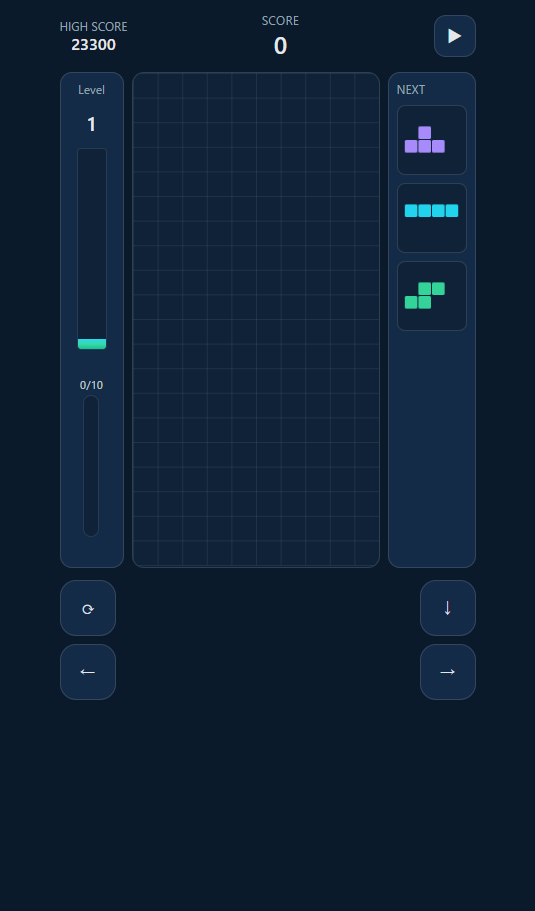
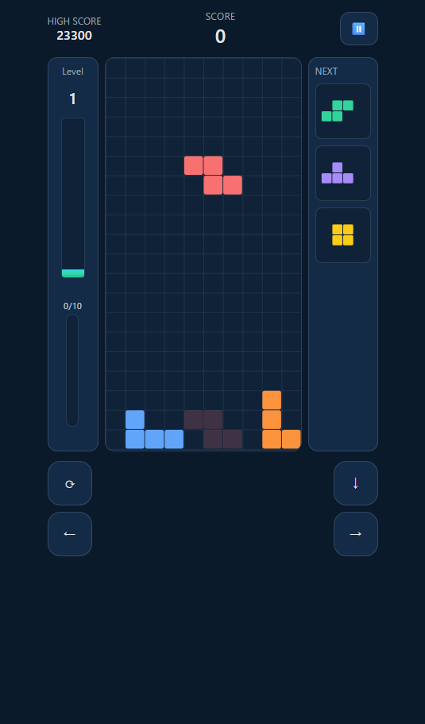
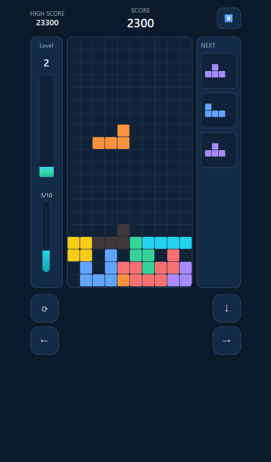
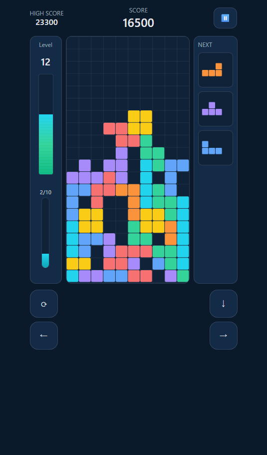
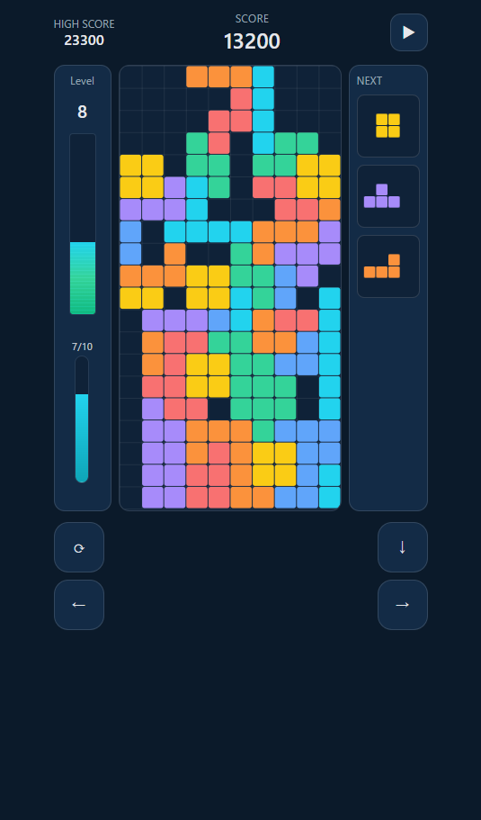

# Tetromino Fall Game

<p>
  <a href="https://seiya-matsuoka.github.io/tetromino-fall-game/"> 
    
  </a>
  <a href="https://github.com/seiya-matsuoka/tetromino-fall-game/actions/workflows/deploy.yml">
    
  </a>
</p>

<p>
  
  
  
</p>

落下パズル（テトロミノ）を 7バッグ・回転・レベル制の重力・スコア・キーボード/タッチ操作で実装。

## デモ

公開 URL: https://seiya-matsuoka.github.io/tetromino-fall-game/

[](https://seiya-matsuoka.github.io/tetromino-fall-game/)

## スクリーンショット

<table>
  <tr>
    <td align="center">
      <a href="./docs/screenshot_1.png">
        
      </a>
    </td>
    <td align="center">
      <a href="./docs/screenshot_2.png">
        
      </a>
    </td>
    <td align="center">
      <a href="./docs/screenshot_3.png">
        
      </a>
    </td>
  </tr>
  <tr>
    <td align="center">
      <a href="./docs/screenshot_4.png">
        
      </a>
    </td>
    <td align="center">
      <a href="./docs/screenshot_5.png">
        
      </a>
    </td>   
  </tr>
  
</table>

## 特徴

- **7バッグ**：偏りを抑えたミノ供給
- **落下（レベル制）**：L1→L20 まで段階的に加速（L20 で上限）
- **ロック遅延**：接地後一定時間で固定
- **ライン消去 & スコア**：1=100 / 2=300 / 3=500 / 4=800（合計ラインに応じて自動レベルアップ）
- **ゴースト**（着地点）表示
- **NEXT ×3** 表示
- **HUD**：スコア・ハイスコア・レベル
- **2 種のレベル UI**
  - レベル進捗ゲージ：次レベルまでの 0–10 ラインを可視化
  - レベルスタック：現在レベルを 20 段の縦バーで可視化
- **キーボード操作**
  - ←/→：移動（ホールドで自動連続）
  - ↓：ソフトドロップ（ホールドで連続）
  - ↑：タップ=右回転、長押し=左回転に変更
  - ↓ 長押し一定時間で ハードドロップ
- **タッチ/クリック操作**：画面下の 4 ボタン（回転/←/→/↓）
- **ポーズ/再開/リスタート**：右上のボタン。初期は停止状態から開始
- **ハイスコア保存**：`localStorage` に保存・読み込み

## ルール

1. ランダム（7 バッグ）で出現するミノを移動・回転して積む
2. 横 1 行が埋まると消去。同時 1–4 行消しで加点
3. 10 行ごとにレベルアップ（最大 L20）
4. 盤面上部まで積み上がるとゲームオーバー

## 操作

| 入力                        | 動作                                                    |
| :-------------------------- | :------------------------------------------------------ |
| <kbd>←</kbd> / <kbd>→</kbd> | 左右移動                                                |
| <kbd>↓</kbd>                | ソフトドロップ（リピート）／長押しでハードドロップ 1 回 |
| <kbd>↑</kbd>                | 右回転（タップ）／長押しで左回転に変更                  |
| 画面ボタン 4 つ             | 回転／←／→／↓（キー or クリック or タップ）             |
| 右上ボタン                  | 停止／再開、ゲームオーバー時はリスタート                |

## セットアップ

```bash
npm i
npm run dev
```

- 本番ビルド：`npm run build`
- プレビュー：`npm run preview`

## ディレクトリ構成

```bash
src/
├─ core/
│ ├─ store.ts     # ゲーム状態（board/active/score/level/lines/next…）
│ ├─ loop.ts      # GameLoop（update/render）
│ ├─ input.ts     # キー入力＋画面ボタン入力
│ ├─ controls.ts  # 画面ボタンと input の接続
│ ├─ collision.ts # 当たり判定・移動/接地判定
│ ├─ lines.ts     # ライン消去と下詰め
│ ├─ srs.ts       # 形状・キック
│ ├─ sevenBag.ts  # 7バッグ
│ └─ types.ts     # 型定義
├─ game/
│ ├─ gameplay.ts  # 進行ロジック（重力/ロック遅延/スポーン/スコア加算など）
│ └─ render.ts    # 描画（盤面・アクティブ・NEXT・HUD）
├─ main.ts        # 初期化（store/gameplay/renderer/loop の組み立て）
└─ style.css      # Tailwind v4

```

## 技術スタック

- **TypeScript**（**Vite**）
- **Tailwind CSS v4**

## セキュリティ / プライバシー

- ハイスコアのみブラウザの `localStorage` に保存

## デプロイ（GitHub Pages）

- `vite.config.ts` の `base` を リポジトリ名に設定
- GitHub Actions（`deploy.yml`）が `main` への push で自動デプロイ

  [](https://github.com/seiya-matsuoka/tetromino-fall-game/actions/workflows/deploy.yml)

## 実装メモ

### 1. ゲームループ図

```bash
index.html  ──>  main.ts  ─────────────┐
                    │                  │
                    │                  │
                    ▼                  │
              createStore()            │         Store.subscribe(...)
                    │                  │                 ▲
                    │                  │                 │
         createGameplay(store, stop)   │                 │
                    │                  │                 │
            createRenderer(store, ctx) │                 │
                    │                  │                 │
            createInputController(...) │                 │
                    │                  │                 │
                    ▼                  │                 │
                 GameLoop  ────────────┴──────────── render(alpha)
                  update(dt)                         (Canvas描画)
                      ├─ inputController.update(dtMs)
                      └─ gameplay.update(dtSec)

```

---

### 2. ゲームループのフロー（一巡）

1. `GameLoop` が一定間隔で `update(dt)` → `render(alpha)` を呼ぶ
2. `gameplay.update()` が進行（重力・NEXT供給・ライン消去・スコア/レベル更新など）
3. `store` に結果を書き込む
4. `store.subscribe(...)` を通じて HUD（スコア/レベル/NEXT 表示） が自動反映
5. `renderer.render()` が盤面とアクティブピース、ゴースト、グリッド線を描画
6. キーボード/画面ボタン → `inputController` が `gameplay.actions` を呼び、次フレームの `update()` で反映

---

### 3. フレームの流れ（空中 → 接地 → 固定）

1. `inputController.update(dtMs)`
   - 押下/長押しに応じて `gameplay.actions`（移動/回転/ドロップ）を発火候補に積む
2. `gameplay.update(dtSec)`
   - アクティブが無ければ `spawnFromNext()`
   - `isGrounded` で接地チェック
   - 空中：`fallTimerMs` >= `interval` で 1 マス落下
   - 接地：動きが無ければ `lockTimerMs` を進め、閾値超で `fixActiveIntoBoard()` → `clearFullLines()` → `addScore`/`addLines` → `spawnFromNext()`
3. `renderer.render(alpha)`
   - `board` / `active` / ゴースト / グリッド を描画
   - HUD は `store.subscribe` によって別途更新

---

### 4. モジュールの役割と関係

| モジュール          | 主な役割                                                                                  | どこから使われるか                                                                               | 主な関数/エクスポート                                                   |
| :------------------ | :---------------------------------------------------------------------------------------- | :----------------------------------------------------------------------------------------------- | :---------------------------------------------------------------------- |
| `core/store.ts`     | ゲーム状態。<br>`set*`/`add*`/`reset`/`seed`/`consumeNext` などのアクションを提供         | `main.ts`（組み立て）、`gameplay.ts`（進行で更新/参照）、`render.ts`（参照）、`input.ts`（参照） | `createStore()`（`getState`, `subscribe`, `set*`, `add*`, `consumeNext` |
| `core/loop.ts`      | 固定タイムステップのゲームループ                                                          | `main.ts`                                                                                        | `GameLoop(start/stop, update, render, timestep)`                        |
| `game/gameplay.ts`  | 進行ロジックの中心。重力・接地・ロック遅延・固定・ライン消去・スコア/レベル更新・スポーン | `main.ts`（`update` 呼び出し）、`input.ts`（`actions` 呼び出し）                                 | `createGameplay(store, stopLoop)` → `{ update, spawnFromNext }`         |
| `game/render.ts`    | Canvas 描画と HUD 反映                                                                    | `main.ts`（`render` 呼び出し）                                                                   | `createRenderer(store, canvas, ctx, ui)` → `{ render }`                 |
| `core/input.ts`     | キー/タッチ入力の集約とリピート制御                                                       | `main.ts`（生成）、`core/controls.ts`（可視化接続）                                              | `clearFullLines(board)`                                                 |
| `core/controls.ts`  | 画面ボタン（←→↓⟳）と `inputController` の結線                                             | `main.ts`（接続）                                                                                | `setupControlsUI(inputController)`                                      |
| `core/collision.ts` | 当たり判定・移動・回転のための補助                                                        | `gameplay.ts`, `main.ts`                                                                         | `tryMove`, `isGrounded`, `tryRotateSRS`                                 |
| `core/lines.ts`     | ライン消去 & 下詰め                                                                       | `gameplay.ts`                                                                                    | `clearFullLines(board)`                                                 |
| `core/srs.ts`       | スポーン位置/向き、各ミノの形状                                                           | `collision.ts`, `gameplay.ts`, `render.ts`                                                       | `spawnPiece`, `shapeAt`, `collides`                                     |
| `core/sevenBag.ts`  | 7 バッグ生成                                                                              | `store.ts`（NEXT 補充）                                                                          | `SevenBag`                                                              |

---

### 5. データフロー（NEXT → スポーン → 固定 → 消去）

1. NEXT 補充：`store.seedNext(count)` が `SevenBag` を用いてNEXTを満たす
2. スポーン：`gameplay.spawnFromNext()` → `store.consumeNext()` → `spawnPiece(type)`
   - スポーン位置で `collides` なら ゲームオーバー（`store.setOver(true)`）
3. 固定：ロック遅延が満了すると `fixActiveIntoBoard()`
4. ライン消去：`clearFullLines` → `n` 行消し
   - `store.addScore(SCORE_TABLE[n])`
   - `store.addLines(n)` → 10 ラインごとに自動 `level` アップ
5. 次のピース：`spawnFromNext()` に戻る

---

### 6. gameplay メモ

- 重力：レベルに応じた間隔で 1 マス落下（`GRAVITY_TABLE_MS` → `getFallIntervalMs()`）
- 接地判定：`isGrounded(board, active)`
- ロック遅延：接地中は静止が続いたときのみカウント。接地しながら移動/回転でリセット
- 固定：一定時間停止 → `fixActiveIntoBoard()` → `clearFullLines()` → `addScore()` → `addLines()`
- スポーン：`consumeNext()` → `spawnPiece(type)` → 衝突していれば Game Over（`stopLoop()`）

内部的に保持する値：

- `fallTimerMs` ：重力の経過時間
- `lockTimerMs` ：接地後のロック遅延
- `wasGrounded` / `lastGroundSig` ：接地継続と動作検出用

---

### 7. renderer メモ

- Canvas 上に 固定ブロック / アクティブピース / ゴースト / グリッド線 を描画
- HUD（スコア、レベル、NEXT、ゲージ）更新  
  → `store.subscribe(...)` で変更時のみ DOM 反映

---

### 8. store メモ

- ゲーム状態を保持（`board`, `active`, `nextQueue`, `score`, `level`, `lines`, `paused`, `over`）
- `subscribe(fn)` で描画と同期
- NEXT 供給：`seedNext(n)` / `consumeNext()`

---

### 9. core/ 配下の機能メモ

- `collision.ts`
  - `tryMove` ：左右移動・ソフトドロップ時の衝突なし移動確認
  - `isGrounded` ：接地判定（1マス下に動けるか）
  - `tryRotateSRS` ：回転
- `srs.ts`
  - `spawnPiece` ：ミノの出現位置/向きを決定
  - `shapeAt` ：4x4 形状を返す
  - `collides` ：衝突検査
- `lines.ts`
  - `clearFullLines(board)` ：行を削除して下詰めし、消去数を返す
- `sevenBag.ts`
  - 7 種のミノを 重複なしシャッフルで供給
- `input.ts` & `controls.ts`
  - キー/タッチを集約して、`gameplay.actions` を呼ぶ
  - 画面ボタン（←→↓⟳）と可視状態（押下中のUI）の同期
